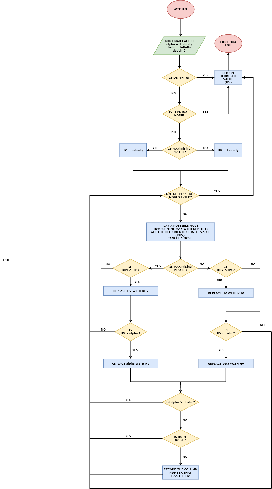
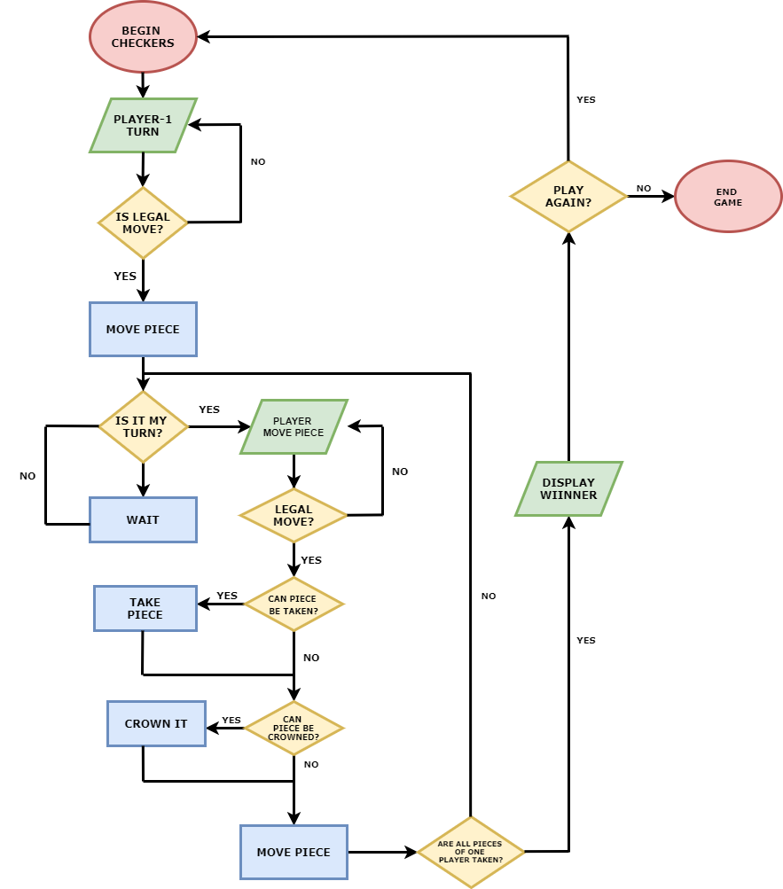

# American-Checkers-AI

#### WEB LINK : https://americancheckersai.netlify.app/

A website to play the American Checkers game with an AI built using the Mini-Max Search tree algorithm and Alpha-Beta pruning.

#### DISCLAIMER : Compatible with Desktop version

# Implentation 
- The game algorithm is implemented using JavaScript.
- The procedure is as the player completes its turn, a search algorithm is called which is what allows the program to look ahead at the possible future positions before deciding what move it wants to make in that current position.
- It’s white turn to move now. In every move, there are only two possible moves to choose between. We can visualize these moves as two separate branches at the end of which are two new positions, of course, it is black’s turn to move now.
- We continue expanding these moves till either we reach the end of the game or we decide to stop because going deeper would take too much time. Either way, at the end of the tree we now have to perform the static evaluation on these final positions. 
- The static evaluation means try to estimate how good the position is on one side without making any more moves.
Large values would favor white and small values would favor black. For this reason, white constantly tries to maximize the evaluation hence known as the Maximizing player. And black is always trying to minimize the evaluation, hence known as the Minimizing player. 
- We start by evaluating the positions on the bottom left. In the previous position, it was white’s turn to move, and since white will always choose the value that leads to the maximum evaluation, we assign the value to the node accordingly and complete the evaluation of that node using the right branch as well.
- Now, black will try to minimize the evaluation function, so we assign the position the lower value by comparing. And we go up the tree hence returning the maximum-minimum gain and getting the higher probable position for white to move. This is where pruning comes into the picture. 
- It would take a lot of time to go down all the branches to get the best value. Without exploring all the nodes through the branch, it tries to get the least or the max value from the already evaluated position. 
- This would result in the player to know that he already has a better option available and that he won’t have to go down the other branch. 
- These checks are made through alpha-beta parameters. 
- This observation concludes that we don’t have to waste any computation in evaluating the final position. Hence, we’ve pruned that position from the tree.

# Flowchart 

# System Environment

Gamer can interact with the system by giving input (selecting the pieces and dragging them to the available tile). System gives those input to the script , if any change occurs( if the value is changed), the object send to renders to display the things (a character can change its place).
